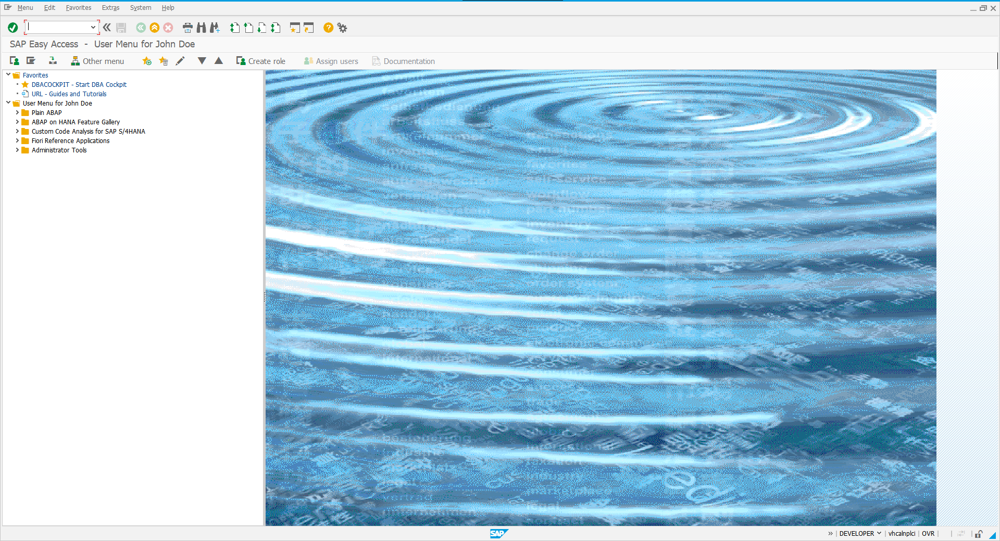

# ABAP
## Respositório de Exposição de Projetos e Estudos em Linguagem ABAP.

# Explicação
Este é um repositório único e exclusivamente para evidenciar e compartilhar meus códigos em ABAP. Enquanto estudo e aprendo com meu curso.

Baixei e instalei o MiniSap em minha própria máquina para esse treinamento.

## Autor                
**Renan de Oliveira Mendes** 

